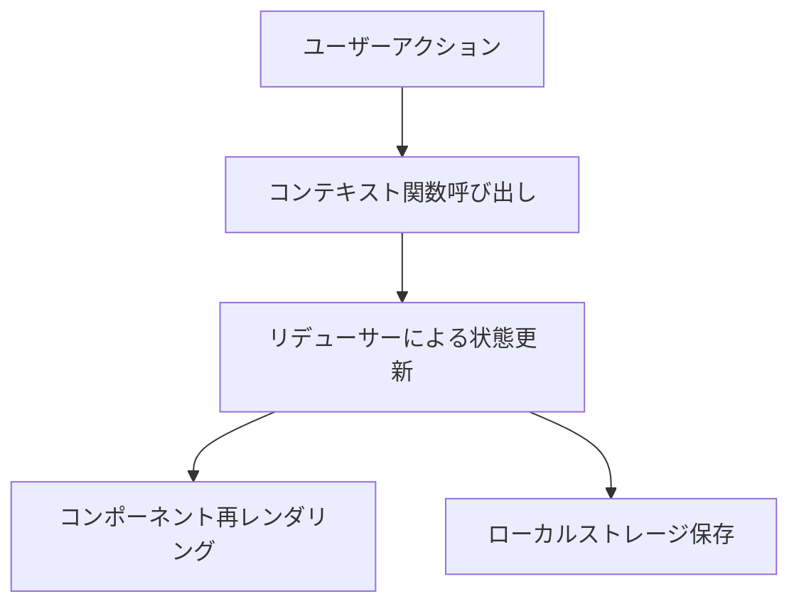

# TODOアプリ設計ドキュメント

## アーキテクチャ概要

このTODOアプリはReact + TypeScriptで実装され、フロントエンドのみで動作します。データはブラウザのローカルストレージに保存され、バックエンドは使用しません。

## コンポーネント設計

Atomic Designパターンに基づいて以下のコンポーネントを実装します：

### Atoms（基本要素）

#### Button
汎用的なボタンコンポーネント。
```typescript
interface ButtonProps {
  children: React.ReactNode;
  onClick: () => void;
  variant?: 'primary' | 'secondary' | 'danger';
  disabled?: boolean;
  type?: 'button' | 'submit' | 'reset';
}
```

#### Input
テキスト入力フィールド。
```typescript
interface InputProps {
  value: string;
  onChange: (e: React.ChangeEvent<HTMLInputElement>) => void;
  placeholder?: string;
  disabled?: boolean;
  onKeyPress?: (e: React.KeyboardEvent<HTMLInputElement>) => void;
}
```

#### Checkbox
チェックボックスコンポーネント。
```typescript
interface CheckboxProps {
  checked: boolean;
  onChange: () => void;
  label?: string;
  disabled?: boolean;
}
```

#### Typography
テキスト表示用コンポーネント。
```typescript
interface TypographyProps {
  children: React.ReactNode;
  variant?: 'h1' | 'h2' | 'h3' | 'body' | 'caption';
  color?: string;
  align?: 'left' | 'center' | 'right';
  decoration?: 'none' | 'underline' | 'line-through';
}
```

### Molecules（分子）

#### TodoItem
個々のTODO項目を表示するコンポーネント。
```typescript
interface TodoItemProps {
  todo: Todo;
  onToggle: (id: string) => void;
  onDelete: (id: string) => void;
  onEdit: (id: string, text: string) => void;
}
```

#### TodoForm
新しいTODOを追加するフォーム。
```typescript
interface TodoFormProps {
  onSubmit: (text: string) => void;
}
```

### Organisms（有機体）

#### TodoList
TODOアイテムのリスト。
```typescript
interface TodoListProps {
  todos: Todo[];
  onToggle: (id: string) => void;
  onDelete: (id: string) => void;
  onEdit: (id: string, text: string) => void;
}
```

#### TodoFilter
フィルタリングオプション。
```typescript
interface TodoFilterProps {
  filter: 'all' | 'active' | 'completed';
  onFilterChange: (filter: 'all' | 'active' | 'completed') => void;
  activeCount: number;
  completedCount: number;
}
```

### Templates（テンプレート）

#### TodoTemplate
TODOアプリのレイアウト構造。
```typescript
interface TodoTemplateProps {
  form: React.ReactNode;
  list: React.ReactNode;
  filter: React.ReactNode;
}
```

### Pages（ページ）

#### TodoPage
アプリケーションのメインページ。

## 状態管理

Context APIを使用して状態を管理します：

```typescript
// TodoContext.tsx
interface TodoContextType {
  todos: Todo[];
  filter: 'all' | 'active' | 'completed';
  addTodo: (text: string) => void;
  toggleTodo: (id: string) => void;
  deleteTodo: (id: string) => void;
  editTodo: (id: string, text: string) => void;
  setFilter: (filter: 'all' | 'active' | 'completed') => void;
}
```

## データフロー

1. ユーザーがTODOを追加/編集/削除/トグルすると、対応するコンテキスト関数が呼び出される
2. コンテキスト内のリデューサーが状態を更新する
3. 状態の変更がコンポーネントに反映される
4. 状態が変更されるたびに、ローカルストレージに保存される



## ローカルストレージ

TODOデータはJSON形式でローカルストレージに保存されます：

```typescript
// utils/localStorage.ts
export const saveTodos = (todos: Todo[]): void => {
  localStorage.setItem('todos', JSON.stringify(todos));
};

export const loadTodos = (): Todo[] => {
  const todosJson = localStorage.getItem('todos');
  if (!todosJson) return [];

  try {
    return JSON.parse(todosJson).map((todo: any) => ({
      ...todo,
      createdAt: new Date(todo.createdAt)
    }));
  } catch (e) {
    console.error('Failed to parse todos from localStorage', e);
    return [];
  }
};
```

## カスタムフック

### useTodos

TODOの状態と操作をカプセル化するカスタムフック。

```typescript
// hooks/useTodos.ts
export const useTodos = () => {
  const [todos, setTodos] = useState<Todo[]>([]);
  const [filter, setFilter] = useState<'all' | 'active' | 'completed'>('all');

  // 初期化時にローカルストレージからデータを読み込む
  useEffect(() => {
    setTodos(loadTodos());
  }, []);

  // 状態が変更されたらローカルストレージに保存
  useEffect(() => {
    saveTodos(todos);
  }, [todos]);

  // フィルタリングされたTODOを取得
  const filteredTodos = useMemo(() => {
    switch (filter) {
      case 'active':
        return todos.filter(todo => !todo.completed);
      case 'completed':
        return todos.filter(todo => todo.completed);
      default:
        return todos;
    }
  }, [todos, filter]);

  // TODOの追加
  const addTodo = useCallback((text: string) => {
    const newTodo: Todo = {
      id: uuidv4(),
      text,
      completed: false,
      createdAt: new Date()
    };
    setTodos(prevTodos => [newTodo, ...prevTodos]);
  }, []);

  // TODOの完了/未完了切り替え
  const toggleTodo = useCallback((id: string) => {
    setTodos(prevTodos =>
      prevTodos.map(todo =>
        todo.id === id ? { ...todo, completed: !todo.completed } : todo
      )
    );
  }, []);

  // TODOの削除
  const deleteTodo = useCallback((id: string) => {
    setTodos(prevTodos => prevTodos.filter(todo => todo.id !== id));
  }, []);

  // TODOの編集
  const editTodo = useCallback((id: string, text: string) => {
    setTodos(prevTodos =>
      prevTodos.map(todo =>
        todo.id === id ? { ...todo, text } : todo
      )
    );
  }, []);

  return {
    todos: filteredTodos,
    filter,
    addTodo,
    toggleTodo,
    deleteTodo,
    editTodo,
    setFilter,
    activeCount: todos.filter(todo => !todo.completed).length,
    completedCount: todos.filter(todo => todo.completed).length
  };
};
```

## ディレクトリ構造

```
src/
├── components/
│   ├── atoms/
│   │   ├── Button/
│   │   │   ├── Button.tsx
│   │   │   ├── Button.test.tsx
│   │   │   └── Button.styles.ts
│   │   ├── Input/
│   │   ├── Checkbox/
│   │   └── Typography/
│   ├── molecules/
│   │   ├── TodoItem/
│   │   │   ├── TodoItem.tsx
│   │   │   ├── TodoItem.test.tsx
│   │   │   └── TodoItem.styles.ts
│   │   └── TodoForm/
│   ├── organisms/
│   │   ├── TodoList/
│   │   └── TodoFilter/
│   ├── templates/
│   │   └── TodoTemplate/
│   └── pages/
│       └── TodoPage/
├── hooks/
│   ├── useTodos.ts
│   └── useTodos.test.ts
├── store/
│   ├── TodoContext.tsx
│   └── TodoContext.test.tsx
├── utils/
│   ├── localStorage.ts
│   └── localStorage.test.ts
├── types/
│   └── index.ts
└── App.tsx
```

## テスト戦略

TDD（テスト駆動開発）方式に従い、以下の順序でテストを実装します：

1. ユーティリティ関数のテスト
2. カスタムフックのテスト
3. Atomsコンポーネントのテスト
4. Moleculesコンポーネントのテスト
5. Organismsコンポーネントのテスト
6. 統合テスト

各テストは以下のパターンに従います：

1. **Red**: 失敗するテストを書く
2. **Green**: テストが通る最小限のコードを実装
3. **Refactor**: コードを改善（テストは引き続き通ることを確認）

## 実装スケジュール

1. **Day 1**: プロジェクト構造のセットアップ、データモデル定義、ユーティリティ関数実装
2. **Day 2**: 状態管理の実装、基本的なAtomsコンポーネント実装
3. **Day 3**: MoleculesとOrganismsコンポーネント実装
4. **Day 4**: TemplatesとPagesコンポーネント実装、スタイリング
5. **Day 5**: テストとリファクタリング、バグ修正
