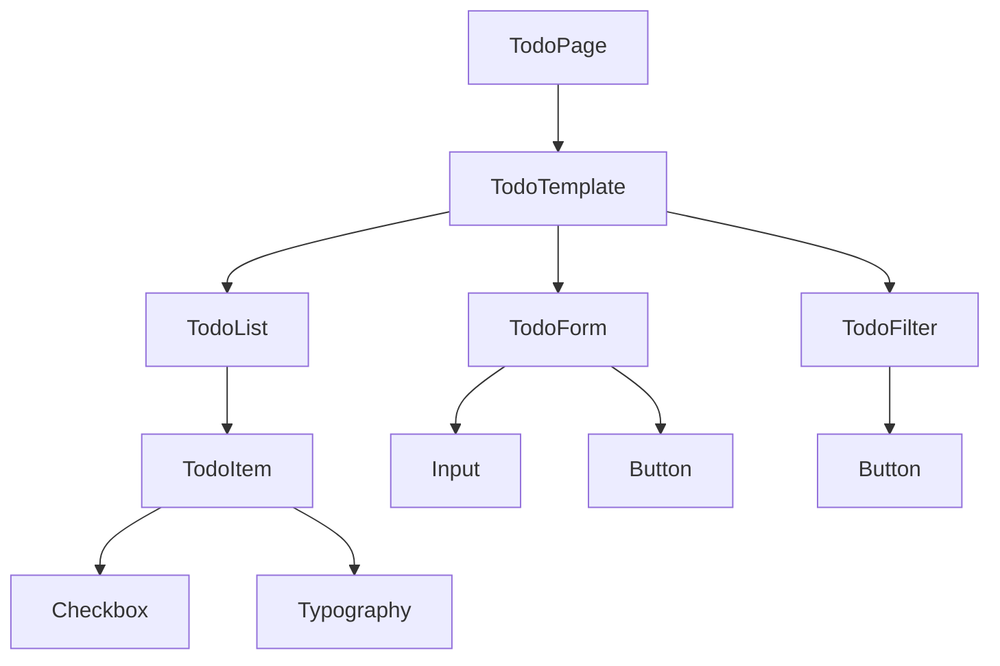

# System Patterns

## アーキテクチャ概要
- Atomic Designに基づくコンポーネント設計
- 単方向データフロー
- コンポジションによるコンポーネント構築

## 主要技術的決定
1. 状態管理: Context API
2. スタイリング: CSS-in-JS
3. データ永続化: ローカルストレージ
4. テスト: Jest + React Testing Library

## デザインパターン
- Atomic Design
  - Atoms: Button, Input, Checkbox, Typography
  - Molecules: TodoForm, TodoItem
  - Organisms: TodoFilter, TodoList
  - Templates: TodoTemplate
  - Pages: TodoPage
- コンテキストパターン
- カスタムフックパターン

## コンポーネント関係図


## データフロー
```mermaid
sequenceDiagram
    participant User
    participant UI
    participant Context
    participant LocalStorage
    
    User->>UI: 操作
    UI->>Context: 状態更新
    Context->>LocalStorage: データ保存
    Context->>UI: 状態反映
    UI->>User: 表示更新
